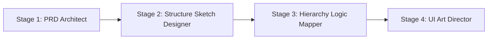

# HTML Design Workflow Skill

A multi-agent UI/UX design workflow that converts design images into production-ready HTML/Tailwind code. This Agent Skill transforms visual designs into working web pages through a structured 4-stage pipeline.

## Overview

This skill orchestrates 4 specialized AI agents in sequence to convert UI screenshots, wireframes, or mockups into fully functional HTML/CSS code. Each stage builds upon the previous one, ensuring a systematic approach to web design generation.

**Use when you need to:**
- Convert UI screenshots to HTML/Tailwind code
- Create PRD documents from visual designs
- Transform wireframes into working code
- Build responsive web pages from mockups

## Quick Start

### 1. Prepare Your Input Files

```bash
# Create the required directories
mkdir -p files/inputs files/workspace

# Add your design image
cp your-design.png files/inputs/target_image.png

# Add a topic/context description
echo "个人主页" > files/inputs/topic.txt
```

### 2. Run the Workflow

The 4-stage pipeline runs sequentially:



**Stage 1: PRD Architect**
- Input: `target_image.png` + `topic.txt`
- Output: `files/workspace/1_prd_draft.md`
- Creates a comprehensive Product Requirements Document

**Stage 2: Structure Sketch Designer**
- Input: PRD draft + original image
- Output: `files/workspace/2_structure_sketch.md`
- Designs the structural layout and component hierarchy

**Stage 3: Hierarchy Logic Mapper**
- Input: PRD + Structure Sketch
- Output: `files/workspace/3_hierarchy_logic.md`
- Maps the logical hierarchy and DOM structure

**Stage 4: UI Art Director**
- Input: PRD (style) + Hierarchy (structure)
- Output: `files/workspace/4_ui_design.md`
- Generates final HTML/Tailwind code

## Technical Stack

- **HTML5** - Semantic markup
- **Tailwind CSS 2.2.19** - Utility-first CSS framework
- **Font Awesome 6.0.0** - Icon library
- **Google Fonts** - Noto Serif SC, Noto Sans SC

## Project Structure

```
html-design-workflow/
├── SKILL.md                 # Main skill documentation
├── README.md                # This file
├── references/              # Detailed agent prompts and workflows
│   ├── agent1-prd-architect.md
│   ├── agent2-sketch-designer.md
│   ├── agent3-logic-mapper.md
│   ├── agent4-ui-director.md
│   └── orchestrator.md      # Pipeline orchestration logic
└── files/                   # Runtime files (created by user)
    ├── inputs/              # Input files
    │   ├── target_image.png
    │   └── topic.txt
    └── workspace/           # Output files (generated)
        ├── 1_prd_draft.md
        ├── 2_structure_sketch.md
        ├── 3_hierarchy_logic.md
        └── 4_ui_design.md
```

## Orchestrator

The orchestrator manages the automated pipeline:
- Verifies all required inputs exist before starting
- Spawns each agent stage sequentially
- Validates output at each stage before proceeding
- Reports completion status and any errors

For detailed orchestrator instructions, see [references/orchestrator.md](references/orchestrator.md)

## Agent Details

Each agent has specialized instructions and prompts:

- **[agent1-prd-architect.md](references/agent1-prd-architect.md)** - Analyzes images and creates PRD documents
- **[agent2-sketch-designer.md](references/agent2-sketch-designer.md)** - Designs structural sketches
- **[agent3-logic-mapper.md](references/agent3-logic-mapper.md)** - Maps component hierarchy and logic
- **[agent4-ui-director.md](references/agent4-ui-director.md)** - Generates final HTML/CSS code

## Usage Example

```bash
# 1. Setup
mkdir -p files/inputs files/workspace

# 2. Add your design (e.g., a personal homepage mockup)
cp ~/designs/personal-homepage.png files/inputs/target_image.png

# 3. Describe the context
echo "Personal portfolio homepage with hero section, about, projects, and contact" > files/inputs/topic.txt

# 4. Run through each stage (manually or via orchestrator)
# Stage 1 generates PRD
# Stage 2 creates structure sketch
# Stage 3 maps hierarchy
# Stage 4 produces final HTML code
```

## Skill Metadata

- **Format Version**: Agent Skills 1.0
- **License**: See project license file
- **Compatibility**: Works with Agent Skills-compatible AI products (Claude Code, etc.)

## Requirements

- Agent Skills-compatible AI agent (e.g., Claude Code)
- Input design image (PNG, JPG, etc.)
- Topic/context description

## Resources

- [Agent Skills Specification](https://agentskills.io/specification)
- [Agent Skills Overview](https://agentskills.io/home)
- [Agent Skills GitHub](https://github.com/syntax-syndicate/agentskills-Spec)

## Contributing

This skill follows the Agent Skills open format standard. Contributions should maintain compatibility with the [Agent Skills specification](https://agentskills.io/specification).

## License

MIT

---

**Built with the [Agent Skills format](https://agentskills.io)** - An open standard for extending AI agent capabilities
